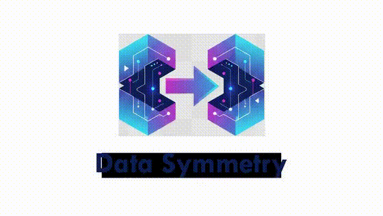

<p align="center">
  
</p>

# Data-Symmetry

A powerful, high-performance command-line utility built in Go for maintaining order and efficiency across your file systems. **Data-Symmetry** (`ds`) provides a suite of concurrent tools for identifying junk, eliminating duplicates, and synchronizing directory trees.

-----

## ✨ Features

The tool offers three primary commands, each designed for a specific file management task:

### 1\. `junksweep`

Finds and optionally deletes common temporary and junk files from a specified directory.

  * **Target Files**: Identifies files matching patterns like Office temporary files (`~$$`), generic temporary files (`.tmp`), LibreOffice locks (`.~lock.`), backup copies (`.bak`), and system files like `Thumbs.db` and `.DS_Store`.

### 2\. `twincheck`

Compares the contents of two directory trees to identify differences and discrepancies.

  * **Comparison Modes**: Supports three levels of content comparison using the `-m` or `--mode` flag:
      * **`off`**: Compares files based on **path and size only**. No hashing is performed.
      * **`smart`**: Runs a content hash only on files that are **missing-by-path** between the two trees.
      * **`strict`**: Performs a **global content hash** comparison for every file, ensuring an exact match of contents, regardless of path differences.

### 3\. `dupekill`

Automatically removes duplicate files from one or more "cleanup" directories that also exist in a designated "reference" directory. This is useful for clearing redundancy while protecting a master set of files.

  * **Duplicate Modes**: Determines how files are considered duplicates:
      * **`path+name`**: Requires the same relative path *and* file name.
      * **`path+hash`**: Requires the same relative path *and* file content (hash).
      * **`hash`**: Only requires the same file content (hash) to be considered a duplicate.

-----

## 💻 Installation

Since the project is written in Go, you can install it easily using the `go install` command, provided you have a Go environment set up.

1.  **Install Go:** Ensure you have the latest stable version of Go installed.
2.  **Install the Tool:**
    ```bash
    go install github.com/bryanbarcelona/data-symmetry@latest
    ```
3.  **Run:** The executable will be installed as `ds` in your Go bin directory (e.g., `$GOPATH/bin`). Ensure this directory is in your system's `PATH`.

-----

## 🚀 Usage

The main command is `ds`, followed by the desired sub-command.

### `ds junksweep` Example

Scans a directory for junk files and prints the list to the console.

```bash
# Scan the 'my-photo-archive' directory
ds junksweep --dir /path/to/my-photo-archive

# Scan and save the list to an output file
ds junksweep -d /path/to/my-photo-archive -o junk_files.txt
```

### `ds twincheck` Example

Compares two directories to check for synchronization status.

```bash
# Basic comparison (path + size only)
ds twincheck -a /drive/a -b /drive/b -m off

# Smart comparison: hash only files missing by path
ds twincheck --a /backup/data --b /live/data --mode smart

# Strict comparison: ensure every file has identical content
ds twincheck --a /master/disk --b /clone/disk --mode strict -o comparison_report.txt
```

### `ds dupekill` Example

Removes duplicates from a cleanup directory against a reference directory.

```bash
# Delete files in /cleanup/ that are duplicates (by hash) of files in /reference/
# (Will prompt for confirmation before deleting)
ds dupekill --reference /path/to/reference --cleanup /path/to/cleanup --mode hash

# Use multiple cleanup directories
ds dupekill --reference /master/photos --cleanup /photos/unsorted --cleanup /photos/old --mode hash

# Use the 'path+name' mode for quick, safe cleanup
ds dupekill --reference /master/files --cleanup /temp/downloaded --mode path+name
```V

For more details on flags for any command, use the `--help` flag:

```bash
ds dupekill --help
```

-----

## 🤝 Contributing

Contributions are welcome\! Please feel free to open an issue or submit a pull request.

-----

## 📄 License

This project is licensed under the **MIT License**.